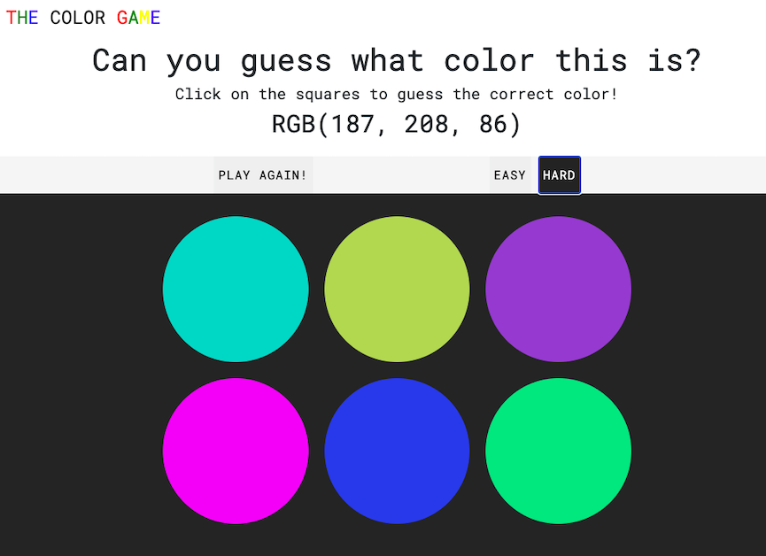
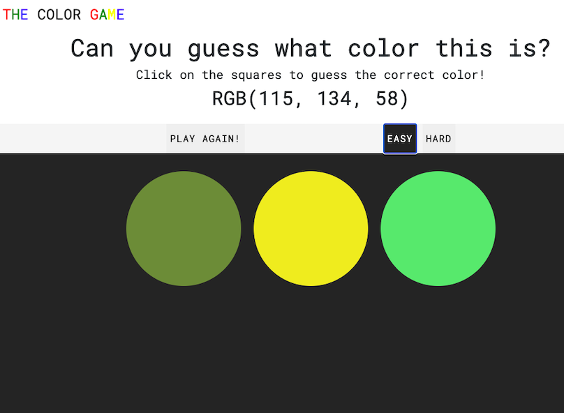
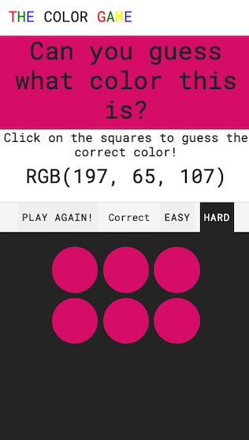

# JAVASCRIPT: RGB COLOR GAME

## Description

Test your rgb skills with this app! In this rgb color guessing game, a random rgb color is generated and the user has to guess. When the user wins, all elements turn the correct color! The user has multiple chances to guess. There are 2 modes: easy and hard.

## Table of Contents

1. [Usage](#Usage)
2. [Github repository and deployed app link](#Github-repository-deployed-link)
3. [App-screenshots](#App-screenshots)
4. [Questions](#Questions)

## Usage

- Click on the deployed app link and start testing your skills!

### Github-repository-deployed-link

- Github repository:
  [Github repository](https://github.com/JessicaPerez1/RGB-Color-Game.git)
- Deployed link:
  [Deployed app link](https://jessicaperez1.github.io/RGB-Color-Game/.)

### App-screenshots

### Questions

For any questions about this app, please refer to my Github page or contact me by email!
This app was created along with Colt Steele in the "Web Developer Bootcamp" course.

- [JessicaPerez1 Github link](https://github.com/JessicaPerez1)
- 1jessicaperez@gmail.com
